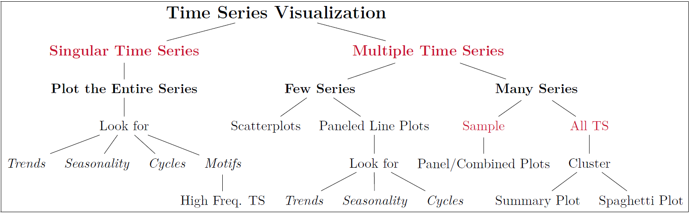

```{r setup, include=FALSE}
knitr::opts_chunk$set(echo = TRUE,
                      warning = FALSE,
                      message = FALSE,
                      cache = FALSE,
                      progress = FALSE, 
                      verbose = FALSE,
                      dpi = 600,
                      dev = 'png',
                      out.width = '100%')
```

# Required Packages
In this section, we will include all the packages used in our analysis. In class, we will add to the packages listed in this template document.

```{r packages}
if(require(pacman) == FALSE) install.packages('pacman') # check and install pacman if needed
pacman::p_load(tidyverse, # load the tidyverse package for ggplot2 and dplyr functions
               magrittr, # for pipe based operators
               lubridate, # used for fixing dates
               plotly, dygraphs) # used for interactive visualizations
               

```


# Visualizing Time Series Data

In today's class, we will utilize the framework listed in [Slide 9 of our notes](https://miamioh.instructure.com/courses/142177/files/18964031?module_item_id=2902123) to construct multiple charts in R. For your convenience, I have a screenshot of the framework in the next subsection. In following subsections, we will construct some of the charts that I have shown in the slides. Recall that our goals for today's class are as follows:  

  (A) Explain different goals for visualizing time series data  
  (B) Identify an appropriate chart for a specific time series data visualization goal  
  (C) Use software to construct charts of interest  
  
Therefore, please ask me questions if you feel that any of these aspects are unclear as we go through class. 


## The Framework

```{r embedForestOutputinR, echo=FALSE, out.width = '90%'}
# Url of the Figure on my GitHub
url1 = 'https://github.com/fmegahed/businessForecasting/blob/master/lectures/03%20-%20Basic%20Tools%20for%20Time%20Series%20Analysis/Figures/snapshot_of_forest_output.png?raw=true'

# Downloading the figure to your computer and including it in the R Markdown
download.file(url1, destfile = 'snapshot_of_forest_output.png', mode = 'wb')

```


## Plots for Singular/Univariate Time Series

### Line Plot

As a quick refresher, let us recreate the plot shown in Slide 11 of the notes. The plot is based on the [FRED RSCCASN Dataset](https://fred.stlouisfed.org/series/RSCCASN), which we will download, read and then use to create the chart. 

```{r lineChart}
# The code for the line chart will be added below.
retailsales = read.csv('https://fred.stlouisfed.org/graph/fredgraph.csv?bgcolor=%23e1e9f0&chart_type=line&drp=0&fo=open%20sans&graph_bgcolor=%23ffffff&height=450&mode=fred&recession_bars=on&txtcolor=%23444444&ts=12&tts=12&width=1168&nt=0&thu=0&trc=0&show_legend=yes&show_axis_titles=yes&show_tooltip=yes&id=RSCCASN&scale=left&cosd=1992-01-01&coed=2020-12-01&line_color=%234572a7&link_values=false&line_style=solid&mark_type=none&mw=3&lw=2&ost=-99999&oet=99999&mma=0&fml=a&fq=Monthly&fam=avg&fgst=lin&fgsnd=2020-02-01&line_index=1&transformation=lin&vintage_date=2021-02-01&revision_date=2021-02-01&nd=1992-01-01')

str(retailsales)

retailsales$DATE %<>% ymd() #%<>% take the object and assign it to the function and then save output in original location
```

```{r}
p = retailsales %>% 
  ggplot(mapping = aes(x = DATE, y = RSCCASN)) +
  geom_line() +
  geom_vline(aes(xintercept = as.Date('2001-03-01'), color = 'red')) +
  geom_vline(aes(xintercept = as.Date('2001-11-01'), color = 'red')) +
  labs(x = "Date", y = "Retail Sales") +
  theme_bw()
```

**Question 1:** Ignoring the economic downturns in between each <span style="color:red;">pair of red lines</span>, how would you characterize this time series? Please provide your answer at www.menti.com


### Interactive Line Plots
We will examine two approaches for constructing an interactive line plot in R. The first is based on the [ggplotly package](https://plotly.com/ggplot2/), and the second one utilizes the [dygraphs package](https://rstudio.github.io/dygraphs/). 

```{r ggplotly}
ggplotly(p, height = 500) %>% highlight()
```

#### Dygraphs {-}
```{r dygraphs}
retailsalesTS = ts(retailsales$RSCCASN, frequency = 12,
                   start = c(1992, 01)) # from base R

dygraph(retailsalesTS, height = 500) %>% dyRangeSelector()
```


### Adding a Trend Line

```{r trendline}
p + geom_smooth(method = 'lm')
```


### Seasonal Plots 
In [Section 2.2.1 of our textbook](https://wessexlearning.com/products/principles-of-business-forecasting-2nd-ed), the authors presented two approaches for considering
seasonality. We can replicate them for our data. For simplicity, let us use the data from
2015-2019 (post housing crisis but before COVID impacting the retailSales). 

```{r seasonalplot}
# create a variable for the month and the year
retailsales$MONTH = month(retailsales$DATE, # first argument has to be in date format
                          label = TRUE) # gives me months spelled out

retailsales$YEAR = year(retailsales$DATE) %>% as.factor()

retailsales %>%
  filter(YEAR %in% c('2015', '2016', '2017', '2018', '2019')) %>% # row-wise operation, from dplyr
  ggplot(aes(x = MONTH, y = RSCCASN, color = YEAR, group = YEAR)) +
  geom_line() +
  theme_bw()
```


### A Statistical Decomposition of the Entire Time Series


## Multiple Time Series

$Y = T + S + E$, where $T$ is the trend, $S$ is the seasonality, and $E$ is the error component.

```{r decomposed}
decomposedTS = decompose(retailsalesTS, # first arg. has to be a time series
                         type = 'additive')
names(decomposedTS)

decomposedTS %>% plot()
```


### Scatterplots
Using the [GermanForecast Data](https://www.wessexlearning.org/pobf2e/dsa/German_forecasts.xlsx), let us create scatterplots and scatterplot matrices in R. 


### Spaghetti and Summary Plots
For the purpose of time, we will not recreate the spaghetti and summary plots in class (primarily since our class focuses on univariate time series data). You are encouraged to learn their code by visiting [this GitHub Page](https://fmegahed.github.io/covid_analysis_final.html), where my collaborators and I have documented the entire analysis that we performed for COVID-19 data .
